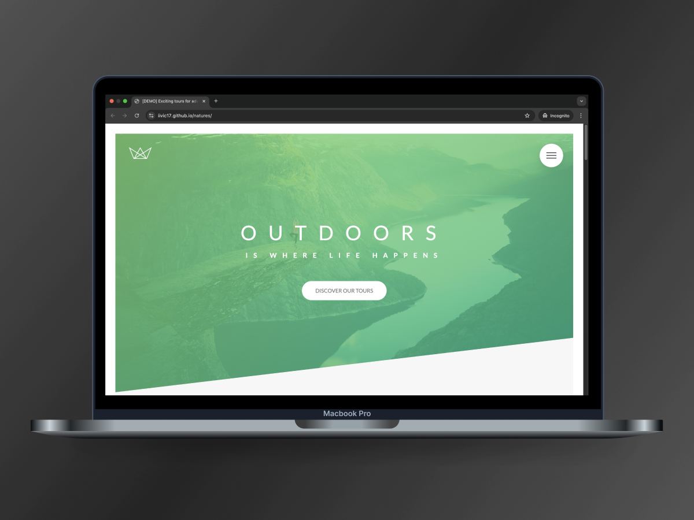

# Natures

A responsive and visually engaging website for showcasing outdoor tours and adventures.

## Features

### ✨ User Interface and Interaction
- Responsive layout designed with **float-based CSS** for cross-device compatibility.
- Smooth animations, including hover effects and transitions for interactive elements.
- Sticky navigation implemented with pure CSS techniques.

### 🌈 Styling and Performance
- Modular **SCSS architecture** for organized and maintainable stylesheets.
- Utilized **media queries** to ensure a seamless experience across devices, including large desktops and small smartphones.
- Custom animations defined with **@keyframes** for engaging user interactions (e.g., button animations and text transitions).

### 📷 Media Optimization
- Responsive images implemented with `srcset` and `sizes` attributes for improved loading times.
- Background video integration for immersive visual effects, with fallback for unsupported browsers.
- Icon fonts used for lightweight and scalable vector graphics.

### 🔒 Semantic and Accessible HTML
- Semantic HTML5 structure following best practices for readability and accessibility.
- Forms include accessible labels and visual feedback for user input validation.

### 🚀 Development Workflow
- Live preview during development via **Live Server** for real-time updates.
- Automated build scripts for:
  - **SCSS compilation** and CSS minification.
  - **Autoprefixing** to ensure browser compatibility.
  - Running parallel development tasks using **npm-run-all**.

## Technologies

### Tools & Libraries
- **node-sass**: SCSS compilation to CSS.
- **PostCSS** with **Autoprefixer**: Ensures CSS compatibility across browsers.
- **npm-run-all**: Task runner for combining development and build processes.
- **Live Server**: Enables live reloading during development.

### CSS Techniques
- **Float-based layout** for responsive and flexible design.
- Custom animations using **@keyframes**.
- **Media queries** for device-specific styling.

