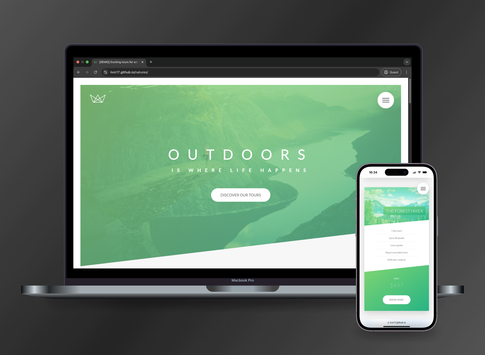

# Natures

Natures is a pure CSS landing page focused on advanced **SASS** techniques, animations, and the **float layout system**. It follows the **BEM methodology** and the **7-1 SASS architecture** to create a responsive and visually engaging design.

## Features

### ✨ User Interface and Interaction
- **Responsive Layout:** Designed with the **float layout system** for cross-device compatibility.
- **Smooth Animations:** Includes hover effects and transitions for interactive elements.
- **Sticky Navigation:** Implemented with pure CSS techniques for a seamless user experience.

### 🌈 Styling and Performance
- **Modular SCSS Architecture:** Organized and maintainable stylesheets using the **7-1 SASS architecture**.
- **Media Queries:** Ensures a seamless experience across devices, including large desktops and small smartphones.
- **Custom Animations:** Defined with **@keyframes** for engaging user interactions, such as button animations and text transitions.

### 📷 Media Optimization
- **Responsive Images:** Implemented with `srcset` and `sizes` attributes for improved loading times.
- **Background Video Integration:** Provides immersive visual effects with fallback options for unsupported browsers.
- **Icon Fonts:** Utilizes lightweight and scalable vector graphics for crisp iconography.
